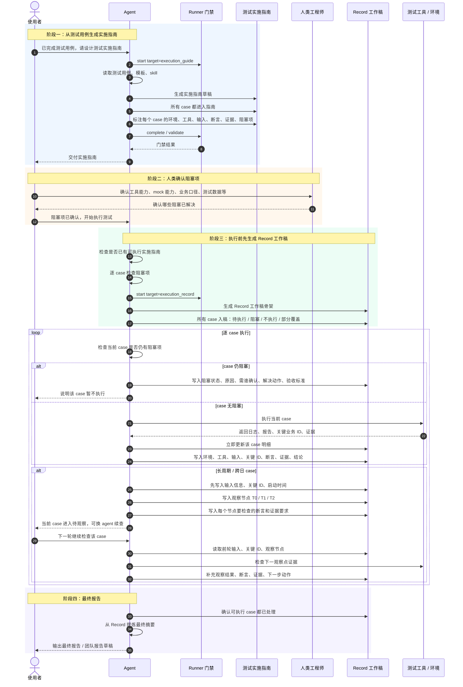

# 测试实施阶段协作流程图

当用户说“我需要进入测试实施阶段了，告诉我怎么进行”或类似表达时，优先展示或解释本图。重点说明：实施指南负责“怎么测”，Record 工作稿负责“测到哪了”，长周期 case 通过 Record 中的输入、关键标识、观察节点和待补证据交接，不依赖聊天上下文续跑。

## 协作节点

| 协作节点 | Agent 做什么 | 人类做什么 | 产物状态 |
| --- | --- | --- | --- |
| 生成实施指南 | 把所有 case 转成可执行步骤，标阻塞项 | 审核方向是否合理 | `test_execution_guide.md` |
| 阻塞确认 | 列出工具、mock、业务口径、数据等待确认项 | 确认是否具备执行条件 | case 从 `阻塞` 变 `待执行` |
| 开始执行 | 启动 Runner，先生成 Record 工作稿 | 不需要手工整理报告 | `execution_record.md` |
| 执行普通 case | 执行一个，更新一个 | 看结果或补充判断 | case 有证据和结论 |
| 执行长周期 case | 先写输入、关键 ID、观察节点 | 后续可换人继续 | case 可续跑 |
| 生成最终报告 | 只从 Record 提炼 | 审核最终口径 | 最终报告 / 团队报告草稿 |

## 一句话说明

实施指南决定“怎么测”，Record 工作稿承接“测到哪了”。长周期 case 不是靠聊天上下文续跑，而是靠 Record 里的输入、关键 ID、观察节点和待补证据续跑。
