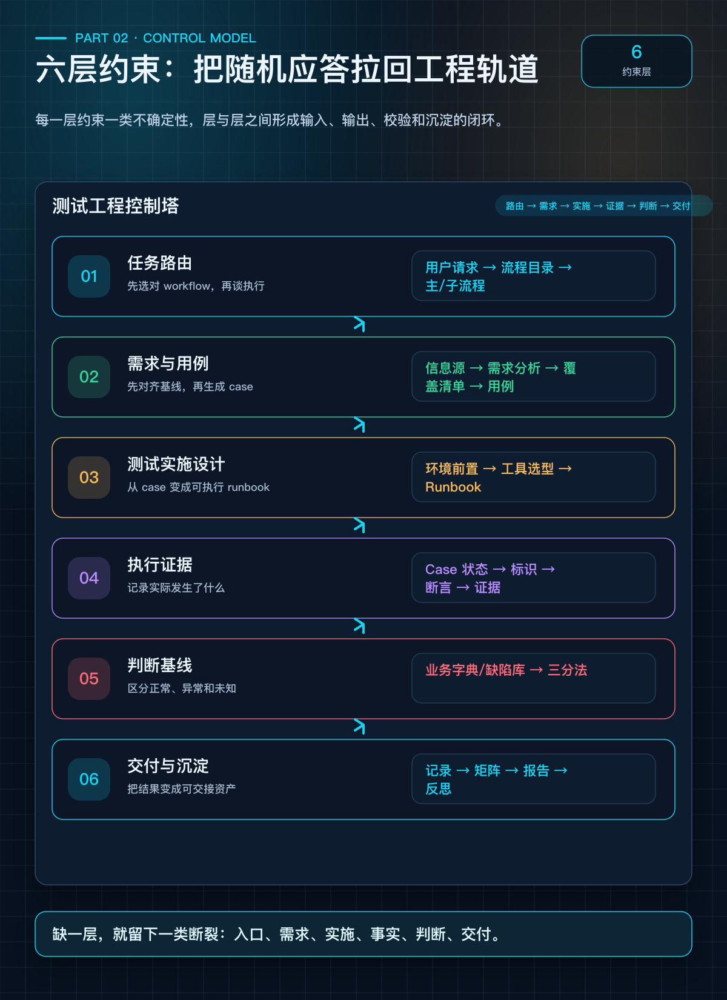
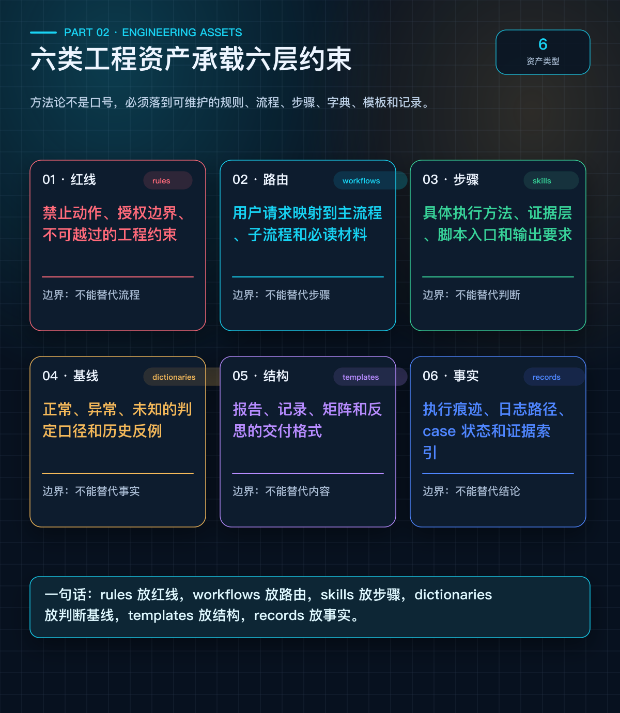

# 第 2 篇：六层约束——把 Agent 从"随机应答"拉回工程轨道

> **系列：《让 AI Agent 真正交付测试结果》· 连载第 2 篇**

---

## 开头

上一篇我们说了：Agent 会写用例，但交付不了测试结果。问题出在缺少工程约束。

那约束应该长什么样？加一堆规则？写一本操作手册？

都不够。我们需要的是一个**分层模型**——每一层解决一类不确定性，层与层之间有明确的输入输出关系。

---

## 核心架构图：六层约束模型

> 配图：`diagrams/output_premium/02_six_layer_model.png`



---

## 第 1 层：任务路由——先选对流程，再谈执行

当 Agent 拥有十几个 skill、几十个脚本时，第一件事不是立刻执行命令，而是判断当前请求应该进入哪条流程。

**没有任务路由时的典型翻车**：
- 用户说"帮我测一下这个功能"，Agent 直接开始下单
- 用户说"看看日切有没有问题"，Agent 去查了部署日志
- 用户说"跑一下回归"，Agent 启动了稳定性测试

**任务路由的作用**：
- 项目级 Workflow Catalog 将用户请求映射到主 workflow
- 声明子流程、必读文档和输出结构
- 未命中时显式说明，而不是临时拼接

> 任务路由让测试体系从"有很多 skill"升级为"知道什么时候用哪个 skill"。

---

## 第 2 层：需求与用例——先对齐基线，再设计 case

Agent 生成用例的速度很快，但如果需求基线本身是错的，快速生成只会快速制造垃圾。

这一层强调三件事：

1. **信息源必须对齐**：需求文档、代码变更、通知邮件、用户口头澄清——这些来源可能互相矛盾
2. **理论覆盖 vs 可执行范围**：有些 case 理论上应该测，但当前环境不可构造输入，必须标记"本轮不执行"
3. **每个 case 能回到覆盖清单**：所有测试项都应能追溯到明确的覆盖目标

---

## 第 3 层：测试实施设计——从 case 到可执行 runbook

这是 Agent 最容易跳过的一层。它拿到 case 就想直接执行，但真实测试需要先回答：

| 问题 | 为什么重要 |
|------|-----------|
| 当前二进制是不是目标版本？ | 错误二进制上的测试结果无法证明目标功能 |
| 配置修改后运行态生效了吗？ | 改了配置不重启 = 没改 |
| 用什么工具执行这个 case？ | 工具选错，证据不可归因 |
| 背景流量会不会污染证据？ | 混入其他订单的结果不可信 |
| 测试结束后环境怎么恢复？ | 不恢复会影响后续测试 |

**工具选型**是这一层的核心环节。它属于实施设计，而不是执行前随手补上的附属动作：

工具选择至少要看七个维度：输入是否可精确构造、断言是否可自动执行、结果能否归因到具体 case、是否需要 mock 外部事件、是否会影响其他测试、是否具备可重复性，以及新增工具的开发成本是否值得。

---

## 第 4 层：执行证据——实际发生了什么

执行证据层解决的是"事实"问题：不是 Agent 声称自己做了什么，而是产物和日志能证明实际发生了什么。

每个 case 的执行记录至少包含：

- **标识类**：clOrdID、OrderId、trace ID
- **运行态**：进程命令、PID、配置版本
- **日志类**：应用日志、event.log、FIX 报文
- **断言结果**：通过 / 失败 / 需复测
- **证据路径**：具体文件位置，可事后复查

> 如果测试结果只存在于聊天窗口，那它就不是测试结果，只是一段对话。

---

## 第 5 层：判断基线——正常、异常还是未知？

测试产出不自动等于测试结论。面对一堆日志和报告，Agent 需要判断：这是正常的、异常的、还是不确定的？

**三分法**：

| 分类 | 判定口径 | 输出要求 |
|------|---------|---------|
| 正常 | 命中业务字典，证据链自洽 | 写入正常列表，说明证据 |
| 异常 | 命中异常字典/历史反例，或跨层证据不自洽 | 写入问题列表，继续补证据 |
| 未知 | 字典外现象、证据不足、业务口径未确认 | 标记待确认，**不得写成结论** |

关键约束：**未知不能写成正常，也不能写成异常。** Agent 最常犯的错误就是把"我不确定"包装成"应该没问题"。

---

## 第 6 层：交付与沉淀——从执行记录到可交接报告

测试结果只有写成可交接的记录和报告，才算完成工程交付。

这一层的规则：
- 测试报告从执行记录和覆盖矩阵提炼，**不新增执行记录里没有的结论**
- 部分覆盖、需复测、本轮不执行、阻塞项必须显式写出
- 测试结束后形成反思候选：规则缺口、workflow 缺口、工具缺口、字典缺口
- 反思候选经人工 review 后才能进入长期知识库

---

## 六层之间的关系

六层不是任意拆分，它们对应功能测试交付中的六类断裂点：

```
入口断裂 ──▶ 第 1 层 任务路由
需求断裂 ──▶ 第 2 层 需求与用例
实施断裂 ──▶ 第 3 层 测试实施设计
事实断裂 ──▶ 第 4 层 执行证据
判断断裂 ──▶ 第 5 层 判断基线
交付断裂 ──▶ 第 6 层 交付与沉淀
```

缺少任一层：
- 没有第 1 层 → Agent 在错误流程中执行正确命令
- 没有第 2 层 → 执行建立在错误预期上
- 没有第 3 层 → 环境和工具错误使 case 失效
- 没有第 4 层 → 结果无法复核
- 没有第 5 层 → 正常、异常和未知被混淆
- 没有第 6 层 → 测试经验重新散落回聊天上下文

---

## 工程资产如何承载六层

六层模型需要真实工程资产来承载，不是空中楼阁：

> 配图：`diagrams/output_premium/02_asset_mapping.png`



一句话总结：

> **rules 放红线，workflows 放路由，skills 放步骤，dictionaries 放判断基线，templates 放结构，records 放事实。**

---

## 人机协作边界

分层约束不意味着所有环节都由 Agent 自主完成。按风险分配：

| 环节 | Agent 可自主 | 需人类确认 | 人类主导 |
|------|------------|-----------|---------|
| 任务路由 | 匹配 workflow | 多 workflow 冲突 | 新增长期 workflow |
| 需求用例 | 生成 case 草案 | 需求冲突、验收口径不明 | 最终业务验收标准 |
| 实施设计 | 梳理环境、工具、runbook | 高风险环境变更 | 生产级变更授权 |
| 执行证据 | 执行命令、采集日志 | 证据链缺层 | 高风险结论定责 |
| 判断基线 | 按字典做初步分类 | 字典外现象 | 新业务规则确认 |
| 交付沉淀 | 生成报告草稿 | 是否沉淀为规则 | 长期流程变更 |

> 人机边界不是静态的。workflow 命中率越高、业务字典越充分、模板越完善，Agent 可自主完成的范围就越大。

---

## 要点总结

- 六层模型的主线是：路由 → 需求 → 实施 → 证据 → 判断 → 交付。
- 每层对应一类工程断裂点，缺少任一层，都会留下可预见的质量风险。
- 工具选型是测试实施设计的核心，不应被拆成执行前的临时判断。
- 判断基线必须坚持正常 / 异常 / 未知三分法，未知不能被包装成结论。
- rules、workflows、skills、dictionaries、templates、records 各司其职，不能互相替代。

---

## 下篇预告

> **第 3 篇：从文档规则到可执行门禁——Test Agent Workflow Runner**
>
> 六层模型写成文档就够了吗？不够。Agent 会跳步、会遗忘、会自作主张。下一篇我们讲如何把文档约束升级为可执行的技术保障——一个配置化的流程门禁系统。

---

*本文基于真实某业务系统测试项目实践总结。*
