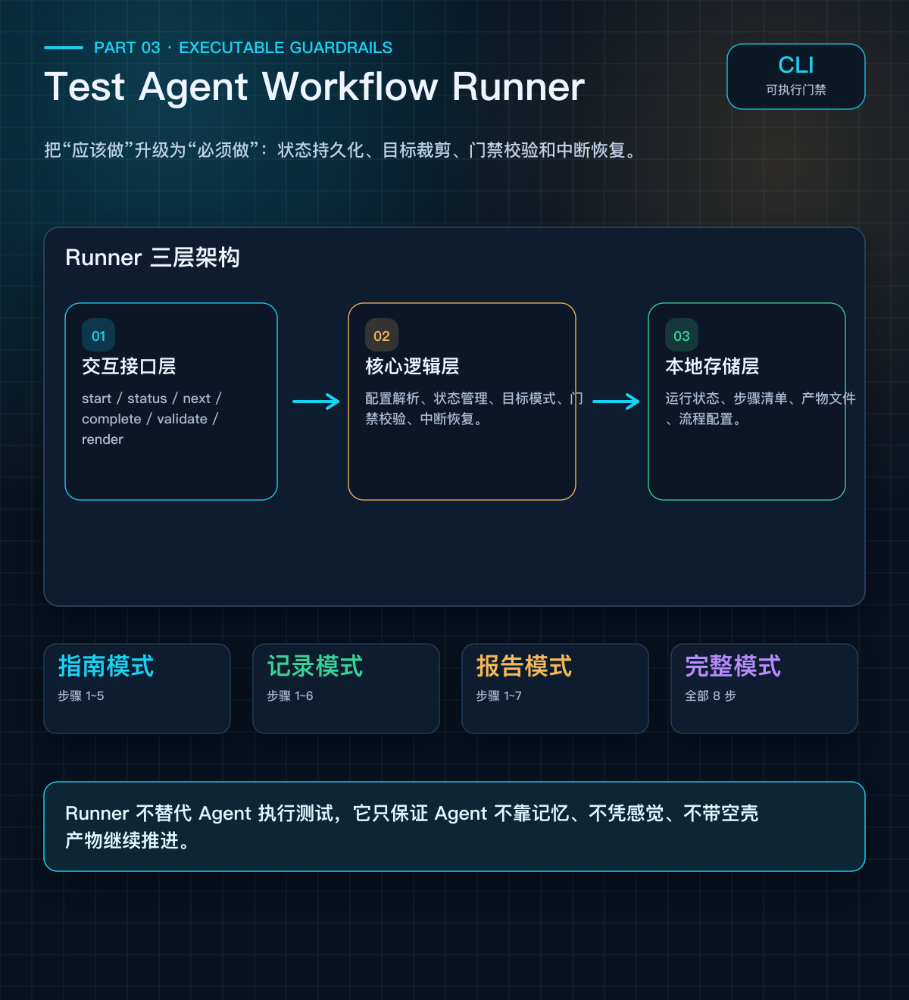
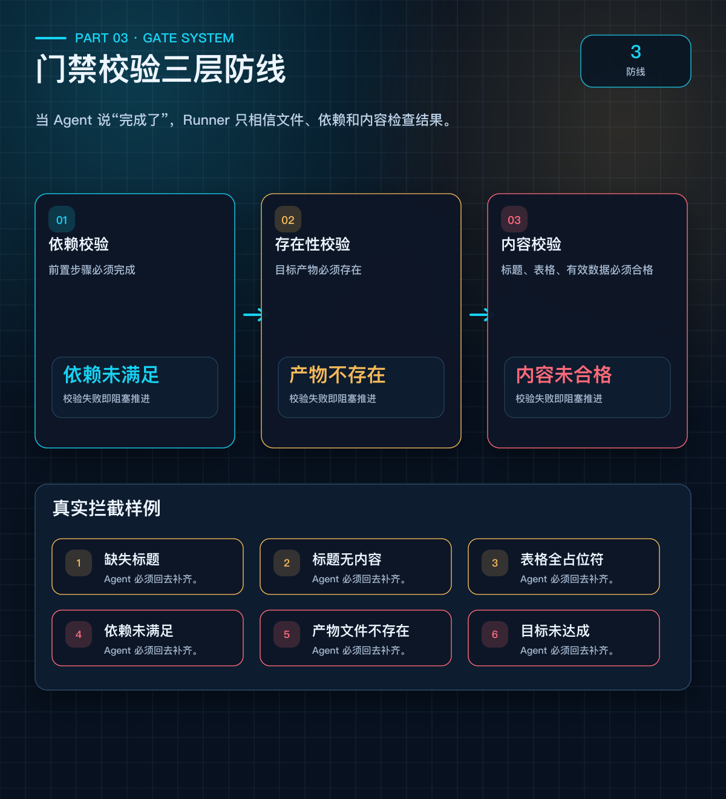

# 第 3 篇：从文档规则到可执行门禁——Test Agent Workflow Runner

> **系列：《让 AI Agent 真正交付测试结果》· 连载第 3 篇**

---

## 开头

上一篇我们提出了六层约束模型。但有个尴尬的问题：

**你把规则写得再好，Agent 也可能跳过它。**

它不是故意的。长对话压缩了早期规则、任务切换忘了前置条件、它"觉得"某步不需要就自己跳了。

所以我们需要把"应该做"升级为"必须做"——校验不通过，流程就推不动。

这就是 Test Agent Workflow Runner 的设计动机。

---

## 文档约束的四个技术瓶颈

| 问题 | 表现 | 后果 |
|------|------|------|
| 流程跳步 | Agent 从用例直接跳到下单，跳过环境确认和工具选型 | 测试结果无法证明目标功能 |
| 上下文丢失 | 跨会话时 Agent 不知道上次做到哪了 | 重复执行或遗漏步骤 |
| 产物质量不可控 | 标题存在但内容为空，表格全是占位符 | 形式合格但实质为空 |
| 流程灵活性不足 | 只需要实施指南时，被迫走完整流程 | 效率低下 |

---

## 核心架构图：Runner 三层架构

> 配图：`diagrams/output_premium/03_runner_architecture.png`



---

## 门禁校验：三层防线

当 Agent 说"这步做完了"时，Runner 不直接接受口头状态，而是执行三层校验：

> 配图：`diagrams/output_premium/03_gate_check.png`



---

## 目标产物模式：按需裁剪

不是每次都要走完整流程。Runner 支持四种目标模式：

| 目标模式 | 必经步骤 | 适用场景 |
|---------|----------|----------|
| `execution_guide` | 步骤 1~5，到实施指南 | 只需要整理测试方案 |
| `execution_record` | 步骤 1~6，到执行记录 | 需要记录执行过程 |
| `report` | 步骤 1~7，到最终报告 | 需要输出正式报告 |
| `full` | 全部 8 步，含反思沉淀 | 完整测试实施闭环 |

创建实例时指定 target，系统自动裁剪必经步骤。后续步骤标记为"当前目标不要求"，不阻塞当前目标完成。

---

## 状态持久化与中断恢复

所有状态写入本地 JSON 文件，不依赖 Agent 的对话记忆：

```
.runs/test_execution/20260520_160449_test-runner/
├── run.json          ← 运行标识、目标、当前步骤
├── checklist.json    ← 每步状态、完成时间、校验错误
└── artifacts/
    ├── 01_input_sources.md
    ├── 02_scope.md
    ├── 03_environment_precheck.md
    ├── 04_tool_selection.md
    └── 05_execution_guide.md
```

**中断恢复流程**：

```
Agent 新会话开始
       │
       ▼
status 命令 ──▶ 读取 run.json + checklist.json
       │
       ▼
next 命令 ──▶ 获取当前步骤 + 产物路径 + 校验要求
       │
       ▼
继续执行 ──▶ 在已有产物基础上补全
       │
       ▼
complete 命令 ──▶ 门禁校验 ──▶ 通过则推进
```

关键约束：**禁止依赖聊天上下文推测进度，必须以持久化文件为唯一事实来源。**

---

## 声明式配置：YAML 定义工作流

工作流通过 YAML 声明，不需要写代码：

```yaml
id: test_execution
name: 测试实施 Workflow

targets:
  execution_guide: execution_guide
  execution_record: execution_record
  report: report
  full: reflection

steps:
  - id: input_sources
    name: 输入资料确认
    output: artifacts/01_input_sources.md
    required_headings:
      - 输入资料
      - 已确认项
      - 待确认项

  - id: scope
    name: 测试范围与执行口径
    depends_on: [input_sources]
    output: artifacts/02_scope.md
    required_headings:
      - 本轮测试范围
      - 不测范围
      - 部分覆盖项

  - id: tool_selection
    name: 测试工具选型
    depends_on: [environment_precheck]
    output: artifacts/04_tool_selection.md
    required_table_columns:
      - Case / 场景
      - 选用工具
      - 断言方式
      - 选择理由
```

新增步骤、修改校验规则、调整依赖关系——只需改 YAML，无需改代码。

---

## 与六层模型的对应关系

Runner 不是独立于方法论之外的工具，它是六层模型的技术保障层：

```
┌──────────────────────┬─────────────────────┬──────────────────┐
│    分层模型层次        │    Runner 步骤       │    门禁规则       │
├──────────────────────┼─────────────────────┼──────────────────┤
│ 第1+2层：路由+需求    │ 输入资料、测试范围    │ 标题校验          │
│ 第3层：实施设计       │ 环境前置判断         │ 6个必需标题       │
│ 第3层：实施设计       │ 工具选型            │ 7列表格+有效数据   │
│ 第3层：实施设计       │ 实施指南            │ 5个必需标题       │
│ 第4层：执行证据       │ 执行记录            │ 6个必需标题       │
│ 第5+6层：判断+交付    │ 最终报告            │ 5个必需标题       │
│ 第6层：沉淀          │ 测试工程反思         │ 4个必需标题       │
└──────────────────────┴─────────────────────┴──────────────────┘
```

> 分层约束模型告诉 Runner"应该约束什么"，Runner 告诉 Agent"必须做到什么"。

---

## 幂等性：重复操作不破坏状态

```bash
# 第一次 complete
$ python runner.py complete <run_id> input_sources
OK: input_sources completed

# 重复 complete（不小心执行了两次）
$ python runner.py complete <run_id> input_sources
already completed: input_sources
# 不修改完成时间，不推进指针，不影响后续步骤
```

---

## 设计哲学

Runner 的设计遵循几个原则：

1. **轻量级**：纯 Python CLI + YAML 配置 + JSON 状态，无外部依赖
2. **声明式**：工作流通过配置定义，不是硬编码
3. **可演进**：方法论演进时，门禁系统同步演进
4. **不替代 Agent**：Runner 不执行测试，只保证 Agent 不跳步
5. **本地优先**：所有状态在本地，不依赖云服务

---

## 要点总结

- 文档约束依赖 Agent 自觉，门禁系统把关键步骤变成强制校验。
- 三层校验覆盖依赖、产物存在性和内容质量，任一层失败都会阻止流程推进。
- 目标产物模式支持按需裁剪，不要求所有任务都走完整闭环。
- 状态持久化让跨会话恢复有据可依，不再依赖聊天记忆。
- 声明式配置让 workflow 可以随方法论演进，而不需要频繁改代码。

---

## 下篇预告

> **第 4 篇：实战验证——两个真实案例的完整闭环**
>
> 理论讲完了，来看真实案例。一个复杂业务功能、一个 Runner 自身测试，分别验证方法论的纠偏能力和门禁系统的技术保障能力。

---

*本文基于真实某业务系统测试项目实践总结。*
