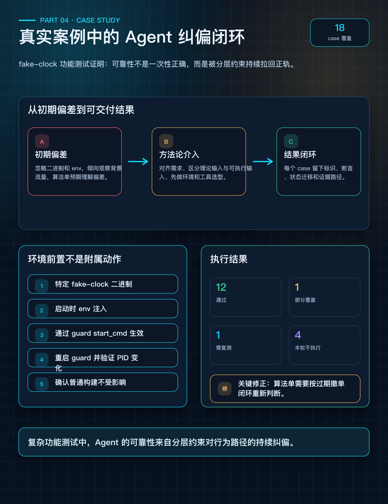

# 第 4 篇：实战验证——两个真实案例的完整闭环

> **系列：《让 AI Agent 真正交付测试结果》· 连载第 4 篇**

---

## 开头

前三篇我们讲了问题、模型和工具。但方法论如果不能在真实项目中跑通，就只是纸上谈兵。

这一篇，我们用两个真实案例展示：Agent 一开始犯了什么错，方法论如何介入，最终交付了什么。

不美化，不隐藏翻车过程。



---

## 案例一：某业务网关虚拟时钟漂移功能测试

### 案例背景

某某业务系统的交易网关组件新增了虚拟墙钟漂移能力，用于联调和仿真测试中验证"日内订单过期时间"逻辑。核心公式为：

```
虚拟当前时间 = 真实当前时间 + VIRTUAL_CLOCK_DRIFT_SEC
```

过期判断为：

```
DayOrderExpireTime != 0 && 虚拟当前时间 >= DayOrderExpireTime
  → 触发过期拒单
```

正 drift 让订单更早过期，负 drift 延后过期，`DayOrderExpireTime=0` 表示不过期。该能力只在特定 fake-clock 构建中生效，普通构建不受影响。

### 这个需求为什么难测

难点不在于"下一个单看看结果"，而在于测试前提和证据链：

```
┌─────────────────────────────────────────────────────────────────┐
│                    虚拟时钟漂移测试难点                             │
├─────────────────────────────────────────────────────────────────┤
│                                                                 │
│  1. 环境前置不是附属动作                                          │
│     ┌─────────────────────────────────────────────────────┐    │
│     │  fake-clock 能力依赖：                                │    │
│     │  • 特定二进制（fake-clock 构建版本）                    │    │
│     │  • 启动时环境变量注入                                  │    │
│     │  • 必须通过进程守护服务的启动命令注入                    │    │
│     │  • 修改后必须重启守护服务并验证 PID 变化               │    │
│     └─────────────────────────────────────────────────────┘    │
│                                                                 │
│  2. DayOrderExpireTime 不能任意构造                              │
│     由上游服务根据交易日历计算后下发，测试脚本无法手工传入          │
│                                                                 │
│  3. 普通单和算法单入口不同                                       │
│     普通单 → 自动化框架直接下单                                   │
│     算法单 → 先下算法单 → 模拟行情触发 → 算法引擎送单到网关       │
│                                                                 │
│  4. 背景流量会污染证据                                           │
│     稳定性脚本持续下单，订单不可控，证据不可精确归因               │
│                                                                 │
└─────────────────────────────────────────────────────────────────┘
```

### Agent 初期偏差

| 偏差 | Agent 的表现 | 若未纠正的后果 |
|------|-------------|--------------|
| 忽略环境前置 | 一开始关注下单逻辑，没有第一时间确认二进制和 env | 即使结果符合预期，也无法证明是 fake-clock 行为 |
| 工具选型不充分 | 倾向观察稳定性脚本的订单 | 订单标识不可控，证据无法归因到具体 case |
| 混淆工具前提 | 将不同入口的前置条件混在一起 | 测试准备复杂化，增加出错概率 |
| 执行记录滞后 | 不是所有 case 一开始都按模板补齐 | 报告阶段容易补写推断而非事实 |
| 错误理解算法单预期 | 初期按"直接拒绝"理解 | 忽略算法单需要闭环终态 |

> 注意：这些偏差并不是简单的能力问题。缺少工程约束时，Agent 的行为路径本来就难以预测。

### 方法论如何介入

**用例设计阶段**：对需求通知、代码变更和用户澄清进行对齐，形成 18 个 case 和覆盖清单。关键决策——区分**理论输入**与**当前可执行输入**：

```
┌──────────────────────────────────────────────────────────┐
│  理论上应该测，但当前不可执行的 case：                       │
│                                                          │
│  • DayOrderExpireTime = 0（不过期）                       │
│    → 当前环境下上游服务不会下发 0，无法构造                 │
│    → 标记"本轮不执行"，不是"通过"也不是"失败"             │
│                                                          │
│  • 真实已过期订单                                         │
│    → 需要等到真实过期时间点，当前窗口不可控                 │
│    → 标记"本轮不执行"                                    │
└──────────────────────────────────────────────────────────┘
```

**测试实施设计阶段**：先解决环境和工具，而不是直接下单。

工具选型决策：

| 场景 | 工具选择 | 选择理由 |
|------|---------|---------|
| 普通未过期 ACK | 自动化框架独立 type | 输入可归因，有断言 |
| 普通过期拒单 | 自动化框架独立 type | 可断言拒单状态码 |
| 算法单入口 | 自动化框架 + 行情模拟 | 需要触发行情让算法引擎送单 |
| 背景稳定性流量 | **不采用** | 订单不可控，证据不可精确归因 |

**执行证据层**：每个 case 保存订单标识、内部标识、过期时间下发值、回包断言、状态迁移日志和南向无发送证据。

**层间反馈**：某个算法单 case 实际是"过期撤单闭环"而非"直接新单拒绝"，这个发现反馈到判断基线层，修正了 case 预期。

### 执行结果

| 状态 | Case 数 | 说明 |
|------|---------|------|
| 通过 | 12 | 覆盖 drift=0、正漂移、非法 env、未设置 env、算法单入口、普通构建回归 |
| 部分覆盖 | 1 | 负漂移只覆盖"不误拒正常未到期订单" |
| 需复测 | 1 | 已验证超过边界会过期，未达严格边界精度 |
| 本轮不执行 | 4 | 输入当前不可构造 / 已由 UAT 人工完成 |

### 案例结论

> 复杂功能测试中，Agent 的可靠性来自持续纠偏：每一层约束都在把它拉回可验证、可复核、可交付的轨道。

---

## 案例二：Runner 自身的 43 条用例测试

Runner 自身的功能测试是方法论的一次"自举验证"——用方法论约束的流程来测试方法论的实现工具。

### 门禁的真实拦截记录

```bash
# 拦截 1：缺失标题
$ python runner.py complete <run_id> input_sources
BLOCKED: missing heading: 待确认项

# 拦截 2：标题无内容
$ python runner.py complete <run_id> input_sources
BLOCKED: heading has no content: 待确认项

# 拦截 3：依赖未满足
$ python runner.py complete <run_id> execution_guide
dependency not met: tool_selection

# 拦截 4：表格全占位符
$ python runner.py complete <run_id> tool_selection
BLOCKED: no valid data rows (all placeholder)

# 拦截 5：产物文件不存在
$ python runner.py complete <run_id> scope
BLOCKED: artifact not found: artifacts/02_scope.md
```

每次拦截都迫使 Agent 回去补全内容，而不是带着空壳继续推进。

### 中断恢复验证

```bash
# 步骤被阻塞后恢复
$ python runner.py next <run_id>
current_step: environment_precheck
output: artifacts/03_environment_precheck.md
validation_errors:
  - missing heading: 恢复基线
```

Agent 通过 `next` 命令获取阻塞原因，修正产物后重新提交，通过校验。

### 幂等性验证

```bash
# 第一次 complete
$ python runner.py complete <run_id> input_sources
OK: input_sources completed

# 重复 complete
$ python runner.py complete <run_id> input_sources
already completed: input_sources
# 不修改完成时间，不推进指针，不影响后续步骤
```

### 发现的 2 个缺陷

| 缺陷 | 现象 | 修复 |
|------|------|------|
| run_id 同秒冲突 | 连续快速创建同名需求，run_id 重复 | 加入微秒级精度 |
| 重复 step id 未拒绝 | 配置中有重复 step id 时未报错 | 增加唯一性校验 |

两个缺陷在同一天内完成修复和复测验证。

### 完整 happy path 验证

`full` 目标模式下 8 步全部通过门禁校验，`validate` 返回 `target achieved`。

### 最终结果

| 指标 | 数值 |
|------|------|
| 设计用例 | 43 条 |
| 首轮通过 | 41 条 |
| 首轮失败 | 2 条 |
| 修复后复测通过 | 2 条 |
| 最终通过率 | 100% |
| 产生的 run 实例 | 20 个 |
| 门禁实际拦截次数 | 多次 |

---

## 两个案例的对比

```
┌──────────────────┬─────────────────────────┬─────────────────────┐
│  维度             │  虚拟时钟漂移测试         │  Runner 自身测试      │
├──────────────────┼─────────────────────────┼─────────────────────┤
│  测试对象         │  业务功能                │  工具软件             │
│  环境复杂度       │  高（远端+守护服务）      │  低（本地 Python）    │
│  方法论价值       │  纠正 Agent 初期偏差     │  验证门禁拦截效果     │
│  发现缺陷         │  0（功能验证通过）       │  2（工具自身缺陷）    │
│  Runner 参与      │  无（当时未实现）        │  全程参与             │
└──────────────────┴─────────────────────────┴─────────────────────┘
```

> 案例一验证了分层约束对 Agent 行为的纠偏效果；案例二验证了门禁系统的技术保障能力。

---

## 案例结论

```
┌─────────────────────────────────────────────────────────────────┐
│                                                                 │
│  Agent 的可靠性不是来自单次回答的正确性，                          │
│  而是来自分层约束对其行为的持续收敛。                              │
│                                                                 │
│  • 任务路由让 Agent 先意识到环境前置                              │
│  • 用例设计澄清了理论输入与可执行输入                             │
│  • 实施设计补齐了二进制、env、守护服务、PID 和工具选型            │
│  • 执行证据层保存了真实日志和标识                                 │
│  • 判断基线使不可构造输入不被误写成失败或通过                      │
│  • 门禁系统在 Agent 跳步时实时阻止                               │
│                                                                 │
└─────────────────────────────────────────────────────────────────┘
```

---

## 要点总结

- 真实案例中，Agent 的初期偏差是常态，需要被流程识别和纠正。
- 方法论的价值在于持续纠偏，而不是追求一次性正确。
- "本轮不执行"是诚实的测试状态，不能被误写成通过或失败。
- 门禁拦截不是形式动作，它能阻止空壳产物进入后续流程。
- Runner 自测说明：方法论不仅能约束业务测试，也能反向发现工具自身缺陷。

---

## 下篇预告

> **第 5 篇：人机边界与未来——Agent 测试工程的演进方向**
>
> 最后一篇，我们聊聊：哪些事 Agent 可以自主做？哪些必须人类确认？这套方法论的边界在哪？未来会怎么演进？

---

*本文基于真实某业务系统测试项目实践总结。*
