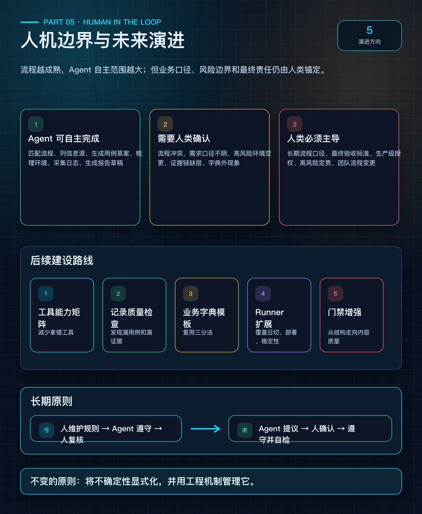

# 第 5 篇：人机边界与未来——Agent 测试工程的演进方向

> **系列：《让 AI Agent 真正交付测试结果》· 连载第 5 篇（完结篇）**

---

## 开头

前四篇我们完成了：问题定义 → 六层模型 → 门禁系统 → 实战验证。

最后一篇，聊三个问题：
1. 这套方法论的边界在哪？
2. 人和 Agent 各自负责什么？
3. 未来会怎么演进？



---

## 方法论的四个有效性

这套方法论的价值，可以概括为四点：

1. **让 Agent 测试行为可控**：workflow、skill、模板和门禁共同约束下一步动作，Agent 不再只依赖上下文记忆做判断。
2. **让测试结果可复核**：执行记录、状态持久化和证据路径把过程沉下来，任何人都可以事后追溯。
3. **让测试经验可沉淀**：反思候选进入规则、workflow、skill 或业务字典，经验不再散落在聊天上下文里。
4. **让流程约束可演进**：工作流通过 YAML 配置化，方法论升级时，门禁系统也能同步调整。

---

## 方法论的五个明确边界

不夸大，不回避局限：

### 边界 1：不能保证 Agent 永远正确

方法论提升的是**可控性和可复核性**，不是消除所有错误。Agent 仍可能在门禁通过后的具体执行中犯错。

### 边界 2：依赖工程资产的质量

若 workflow 不完整、skill 过时、业务字典缺失、工具没有断言能力，Agent 仍可能执行出低质量结果。门禁只能校验产物结构，不能校验业务正确性。

### 边界 3：仍需人类确认关键业务口径

交易日历、日切规则、维护窗口、异常定性、高风险结论——这些必须由人类确认。

### 边界 4：有维护成本

完整分层约束需要维护 workflow、skill、模板、业务字典和执行记录。对于简单冒烟测试，可以只轻量激活部分层次。

### 边界 5：门禁粒度有限

当前版本只做结构校验（标题存在性、非空内容、表格列完整性、占位符检测），不做语义校验。Agent 可以写出结构合格但内容质量低的产物通过门禁。

---

## 人机协作边界：谁做什么

```
┌─────────────────────────────────────────────────────────────────────┐
│                    人机协作边界                                       │
├─────────────────────────────────────────────────────────────────────┤
│                                                                     │
│         Agent 可自主完成              需人类确认                      │
│  ┌─────────────────────────┐  ┌─────────────────────────────┐     │
│  │ • 匹配 workflow          │  │ • workflow 未命中/冲突        │     │
│  │ • 列信息源               │  │ • 需求冲突                   │     │
│  │ • 生成 case 草案         │  │ • 验收口径不明               │     │
│  │ • 梳理环境前置           │  │ • 高风险环境变更             │     │
│  │ • 工具选型               │  │ • 缺少工具能力               │     │
│  │ • 执行命令               │  │ • 证据链缺层                 │     │
│  │ • 采集日志               │  │ • 结果互相矛盾               │     │
│  │ • 按字典做初步分类       │  │ • 字典外现象                 │     │
│  │ • 生成报告草稿           │  │ • 业务口径未确认             │     │
│  │ • 生成反思候选           │  │ • 是否沉淀为规则             │     │
│  └─────────────────────────┘  └─────────────────────────────┘     │
│                                                                     │
│                        人类必须主导                                   │
│  ┌─────────────────────────────────────────────────────────────┐   │
│  │ • 新增长期 workflow 口径                                      │   │
│  │ • 最终业务验收标准                                            │   │
│  │ • 生产级变更授权                                              │   │
│  │ • 高风险结论定责                                              │   │
│  │ • 新业务规则确认                                              │   │
│  │ • 长期规则和团队流程变更                                       │   │
│  └─────────────────────────────────────────────────────────────┘   │
│                                                                     │
│  ──────────────────────────────────────────────────────────────     │
│  人机边界不是静态的。                                                 │
│  workflow 命中率越高、字典越充分、模板越完善                           │
│  → Agent 可自主完成的范围越大                                        │
└─────────────────────────────────────────────────────────────────────┘
```

---

## 外部适用性：不只是这两个案例

六层模型不只服务于虚拟时钟测试和 Runner 自测。以下任务类型都可以映射到同一组约束层：

| 任务类型 | 重点约束层 | 说明 |
|---------|-----------|------|
| 日切/维护窗口检查 | 路由 + 判断基线 + 证据 + 交付 | 需要业务字典和报告模板 |
| 稳定性失败排查 | 路由 + 证据 + 判断基线 | 需要跨层证据复核 |
| 部署验证 | 路由 + 实施设计 + 证据 | 需要确认包、组件、PID |
| 功能回归 | 实施设计 + 证据 + 交付 | 需要选择 case type、确认断言 |
| 远端环境调查 | 路由 + 证据 | 需要"小命令、短输出"原则 |

---

## 演进方向：五个后续建设

后续可以优先建设五类能力：

1. **测试工具能力矩阵**：帮助 Agent 更稳定地完成工具选型，减少"拿错工具"。
2. **执行记录质量检查脚本**：自动发现漏 case、漏证据、漏恢复记录，把门禁从结构校验推进到内容质量校验。
3. **通用业务字典模板**：让正常 / 异常 / 未知三分法跨需求复用，降低判断基线层的维护成本。
4. **Runner 覆盖更多 workflow 类型**：把日切检查、稳定性分析、部署验证等流程纳入门禁管理。
5. **增强门禁校验规则**：增加 artifact 间引用检查、blocked / 待确认项检测、证据路径存在性校验。

---

## 一个更远的视角

随着 Agent 能力持续提升，具体的 workflow、skill、模板和字典可能会自动生成、自动校验甚至自动演进。但有一个原则不会过时：

> **将不确定性显式化并工程化管理。**

未来的 Agent 测试工程可能从"人工维护资产"走向"资产自动维护"。但人类对关键业务口径、风险边界和最终责任的确认，仍然是闭环的锚点。

今天的形态是：人维护规则，Agent 遵守规则，人复核结果。

未来更可能变成：Agent 提议规则，人确认规则，Agent 遵守并自检，人只在关键节点介入。

但有一点不会变：业务口径、风险边界和最终责任，必须由人来确认。

---

## 系列总结

五篇连载，我们完成了一个完整叙述：

```
第 1 篇：定义问题
         会写用例 ≠ 能交付测试，Agent 有九大工程断点

第 2 篇：提出方案
         六层约束模型，每层解决一类不确定性

第 3 篇：技术保障
         Test Agent Workflow Runner，从文档约束到可执行门禁

第 4 篇：实战验证
         两个真实案例，证明方法论的纠偏效果和门禁拦截价值

第 5 篇：边界与未来
         明确局限，指出演进方向，锚定人机协作原则
```

---

## 全系列核心观点

```
┌─────────────────────────────────────────────────────────────────┐
│                                                                 │
│  1. Agent 测试的挑战不是智力问题，是工程组织问题                   │
│                                                                 │
│  2. 分层约束 > 单点提示词优化                                    │
│                                                                 │
│  3. 文档约束是必要的，但不充分——需要可执行的门禁                  │
│                                                                 │
│  4. Agent 的可靠性来自持续收敛，不是一次性正确                    │
│                                                                 │
│  5. "本轮不执行"和"未知"是诚实的状态，不是失败                   │
│                                                                 │
│  6. 人机边界随工程资产成熟度动态变化                              │
│                                                                 │
│  7. 将不确定性显式化并工程化管理——这个原则不会过时                │
│                                                                 │
└─────────────────────────────────────────────────────────────────┘
```

---

## 致读者

如果你正在尝试让 AI Agent 参与测试工作，真正值得投入的不是让它"看起来更会回答"，而是让它进入一条可控、可复核、可交接的工程链路。

不要只关注用例生成。用例只是起点，后面还有环境、工具、断言、证据、判断和报告。也不要隐藏 Agent 的错误。恰恰相反，纠偏过程本身就是方法论的一部分。

测试工程的本质没有变：把不确定性变得可管理。Agent 只是让这个命题有了新的维度，也让工程约束的重要性变得更清楚。

---

*全系列完。基于真实某业务系统测试项目实践总结。*

---

## 附：系列文章索引

| 篇号 | 标题 | 核心内容 |
|------|------|---------|
| 第 1 篇 | 会写用例 ≠ 能交付测试——Agent 测试的真实困境 | 九大工程断点 + 为什么提示词不够 |
| 第 2 篇 | 六层约束——把 Agent 从"随机应答"拉回工程轨道 | 六层模型 + 工程资产分工 + 人机边界 |
| 第 3 篇 | 从文档规则到可执行门禁——Test Agent Workflow Runner | 三层校验 + 目标模式 + 状态持久化 |
| 第 4 篇 | 实战验证——两个真实案例的完整闭环 | Agent 初期偏差 + 方法论纠偏 + 门禁拦截 |
| 第 5 篇 | 人机边界与未来——Agent 测试工程的演进方向 | 有效性 + 边界 + 演进方向 |
